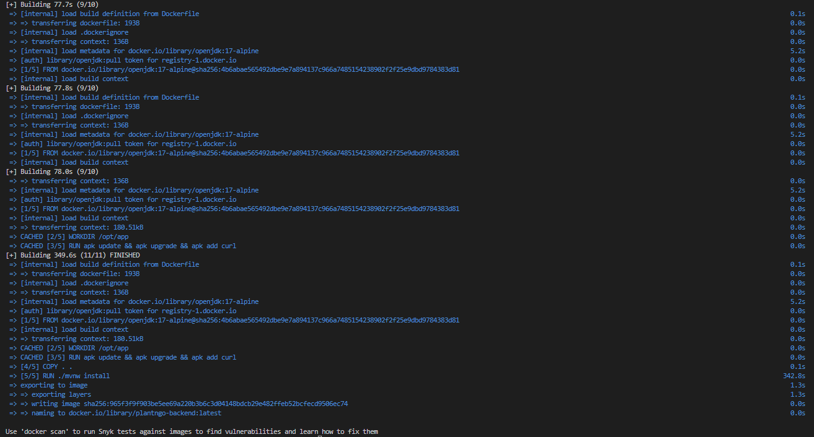
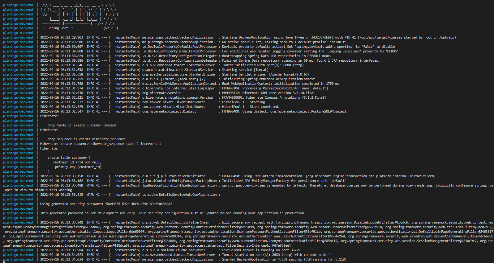
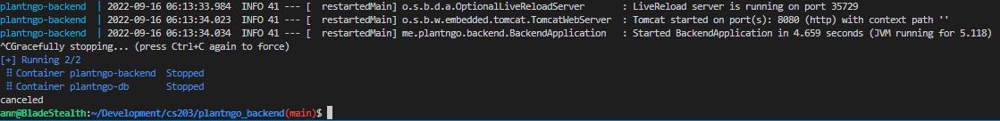
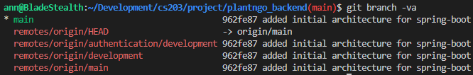
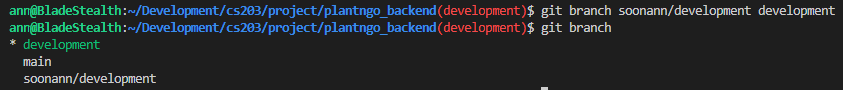
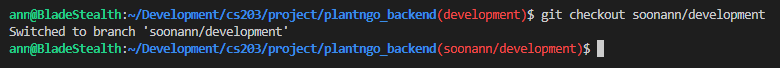
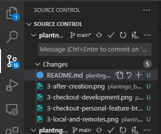
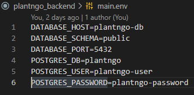
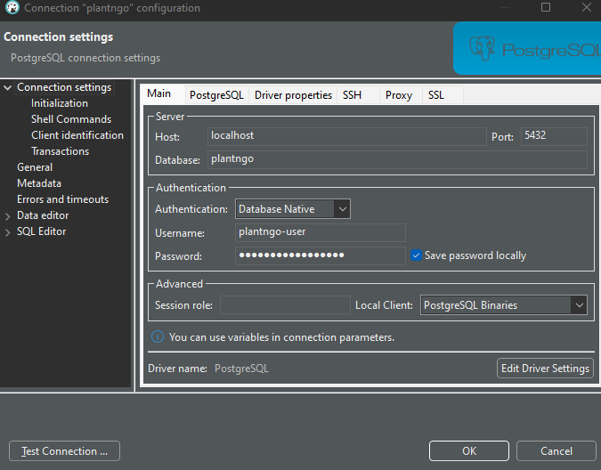

# Plant&Go


## Dependencies 
Before getting starting with development, install the following tools: 
- [Docker](https://www.docker.com/products/docker-desktop/)
- [Git](https://git-scm.com/downloads)

## Getting Started 
### 1. Cloning the project
To get started, you will first need to clone a copy of the project with:
```bash
git clone git@github.com:CS203-T1-Project/plantngo_backend.git
```

This should create a local version of the project that you can work on

### 2. Branching practice
We have the following branches in the project:

- `main`
    - This branch has all the production ready code, all source code pushed to here __must__ have been tested in the `development` branch first. 
- `development`
    - This branch's purpose is to serve as a testing space before new code written by different developers are merged together. Code should be tested properly to ensure there isn't and errors before merging `development` into `main`
- `<feature>/development` OR `<personal>/development`
    - The branch that you will be mostly working on, will be the `feature` or `personal` branches. As we add new features to the application, we will create new branches called `<feature>/development`
        - e.g when building the authentication feature, we will create a `authentication/development` branch to work on.
        - e.g if you wish to do some testing, you can also create a branch under your own name `soonann/development`
    - These branches will branch out from the `development` branch and should be merged back into the `development` branch when development is done
    - It is also recommended to merge frequently to ensure everything is working well with other developer's codes

### 3. Starting the project

You would have already cloned the project from the first step, now you can `cd` into your project:
```bash
cd plantngo_backend
```

Now that you are in your project, you can run the following docker command to build the image: 
```bash
docker compose build
```
This will take some time (a few minutes), but note that you will rarely need to re-build your docker image as there shouldn't be significat changes to the image and you should see something like this in your build log:



To start the project, you can do the following command:
```bash
docker compose up
```


You can edit the source code as this is running. Live reload for springboot is configured, so you can just make changes to your source code and save them and the app will reload to include your changes.

Sometimes the Live Reload will not work properly as certain settings are cached, you can stop the project by going to the console you ran the `docker compose up` command on and pressing `CTRL+C` to exit the project. After which, you can do `docker compose up` again to start the project again.



### 4. Getting started with branches

To start off, you can run the following command to see what branches are available locally and remotely (on Github):
```bash
# -v flag: is used for verbose output to see the last commit for the branch
# -a flag: is used to show all branch (remote and local branches)
git branch -va
```
You should see an output similar to the following:


The branches with the `remotes/origin/` prefixes are the ones that are on the remote git repository, essentially github in our case.

The branches without the `remotes/origin/` prefixes are the branches that exist locally on your desktop.

Since there is already a copy of `development` on our remote repository, we can use the following command to get a local copy of it:
```bash
# changes your current active branch to development
git checkout development
```
You should see an output similar to the following:


---

Now you're in the development branch, you can create your own `feature/personal` branches from here. 

You can do so with the following command:
```bash 
git branch <new-branch> development

# alternatively, if you are already in development branch now, you can use the following command:
git branch <new-branch>

# after running either one of the above commands, you can check if the branch was created with: 
git branch
```
You should see an output similar to the following:


---

Now you have created a branch, you can change your current branch into that branch with the following command:
```bash
git checkout <branch-to-change-to>
```

You should see an output similar to the following:


Take note that to switch between branches, you will use this same command 

You are now in your personal/development branch, you can now start developing the new feature or testing anything you want to. 

As you implement changes to the codebase, you will want to create commits as checkpoints that you can go back to, to do so, you can use the following commands:

```bash
# add all changes made in the project to staging area
git add . 

# commit all changes in staging area
git commit -m '<write your commit message here>'

# push your changes to the remote repository (github)
# note that the command's orginal form is: 
# git push origin someremotebranch
# if you use the -u flag, it will set the upstream branch of your local branch as the specified remote branch (in this case, origin/someremotebranch)
git push -u origin <your-branch-name>

# after your local branch's upstream branch has been set, you can just type the following command the next time you wish to do pushes and it will automatically refer to the upstream branch as the branch to push your local changes to:
git push
```

---

Lets say now you have made commits in your personal branches, and you want to merge them back to `development`, you can do the following commands:

```bash
# checkout to the branch that you wish to merge your changes into
git checkout development

# perform the merge of your feature/personal branch into development
# e.g git merge soonann/development
git merge <feature-branch>
```

Depending on your changes, there might or might not be merge conflicts and you might need to resolve them if there are any, an easy way to do this is to use the VSCode built in git interface.


---

After you have tested that it works locally, you can then update the changes of your local development branch to the remote development branch (github).

```bash
# Because the development branch already had its upstream branch set before automatically, you can just do git push and it will push to its upstream branch origin/development
git push
```

## 5. Connecting to local PostgreSQL database
Note that the docker compose setup makes use of a PostgreSQL database. You can see the credentials for the local database in the `main.env` file.

To connect to the database, you will first need to have the project started. To do so, use the command:
```bash
# start the SpringBoot server and PostgreSQL server
docker compose up
```

After which, you will need to key in your credentials according to the `main.env` file's credentials.

 

In the example below, I used DBeaver to connect to the PostgreSQL server, but you can use any other tools you wish to, just ensure the credentials are keyed in properly as per the `main.env` file above. 

Take note that your host should be written as `localhost` as docker is running on localhost (below is the reason why its written as `plantngo-db` in `main.env`). 
> The docker container for PostgreSQL server is named as `plantngo-db` as per the `docker-compose.yml` file. This naming of the docker container is then applied on the container as a hostname by docker.

>Since we know the container's name tallies with the hostname of the container, we can simply use the container's name as the hostname to resolve for its ip address.




